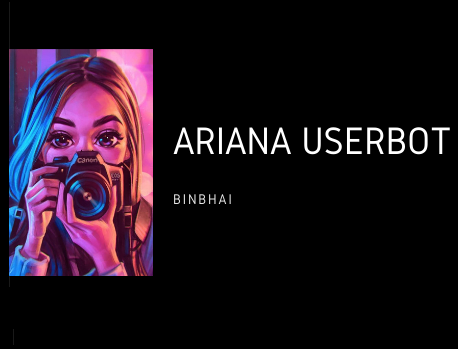

# ArianaUserBot

Best User Bot To Manage Your Telegram Account 
## Most PowerFul And Better And Secure

## By Team BinBhai™

### For any query or want to know how it works join Group And Channel 

## Installing Heroku 

### The Easy Way

Take Sting session from Replit

-------------------------------------------------

## Mandatory Vars

- Only two of the environment variables are mandatory.
- This is because of `telethon.errors.rpc_error_list.ApiIdPublishedFloodError`
    - `APP_ID`:   You can get this value from https://my.telegram.org
    - `API_HASH`:   You can get this value from https://my.telegram.org
- The userbot will not work without setting the mandatory vars.

